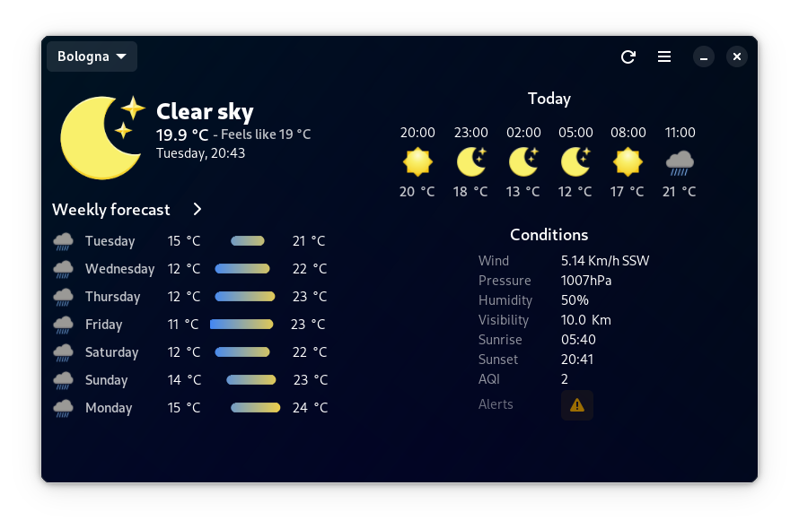

<h1>  <a href='https://forecast.salanileo.dev/'> Forecast </a> </h1>
<h2> Beautiful weather app for Linux </h2>

Here with a complete rework!

<h3>Features 💬</h3>
<ul>
	<li>Clean UI 🪟</li>
	<li>7 Day forecast 'graph' ☀️</li>
	<li>24 Hour hourly forecast ⌛</li>
	<li>One week in depth forecast ☔</li>
	<li>Choose between Metric or Imperial systems 🌍</li>
	<li>... And more to come! 😃</li>
</ul>
<h1>Install ⬇️</h1>
<a href="https://flathub.org/apps/dev.salaniLeo.forecast" rel="nofollow"
	></a
>

<h2>Previews</h2>

