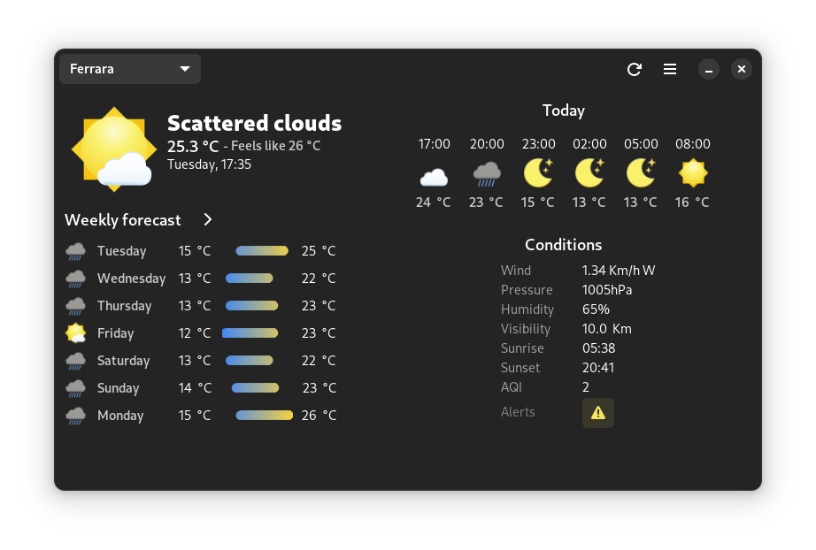
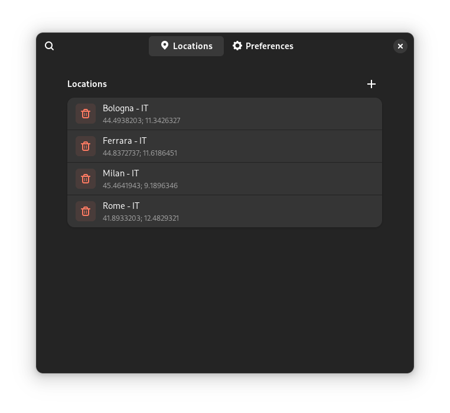

<h1>  <a href='https://forecast.salanileo.dev/'> Forecast </a> </h1>
<h2> Beautiful weather app for Linux </h2>

Here with a complete rework!

<h2>⚠️Warning⚠️</h2>

There is currently a bug in GTK which causes an application to crash when removing a stack page from a stack sidebar, and unfortunately I am using a stack sidebar to manage saved locations. This means that unless GTK maintainers fix the issue I wont release any new 'official' version, but you can still clone this repo and use the app.

<h3>Features 💬</h3>
<ul>
  <li>Mobile friendly user interface 📱</li>
  <li>7 Day forecast 'graph' ☀️</li>
  <li>24 Hour hourly forecast ⌛</li>
  <li>Pollution index 🚬</li>
  <li>One week in depth forecast ☔</li>
  <li>Choose between Metric or Imperial systems 🌍</li>
  <li>... And more to come! 😃</li>
</ul> 
<h2>Install</h2>

<h2>Previews</h2>

